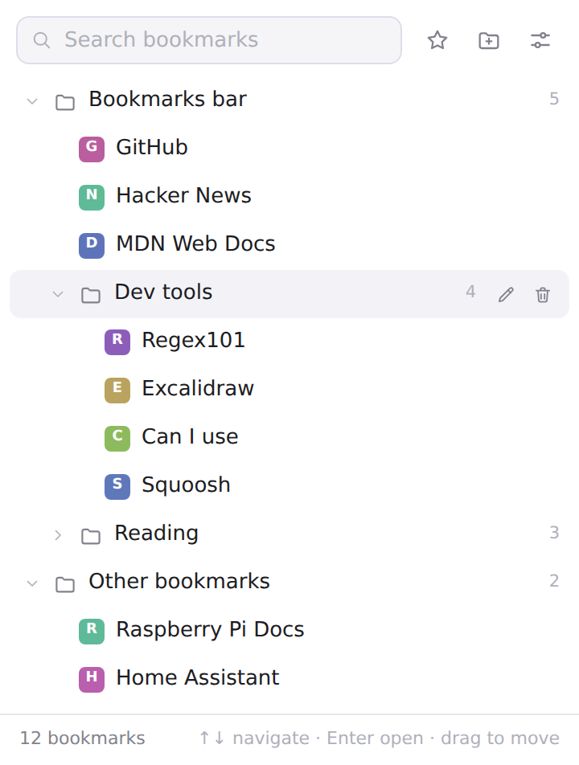
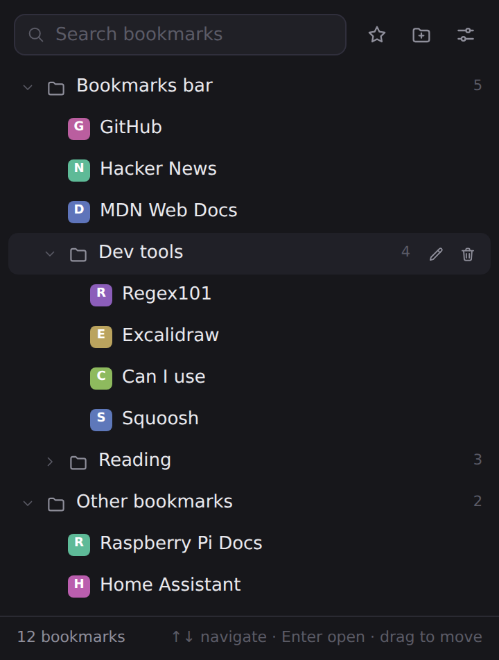
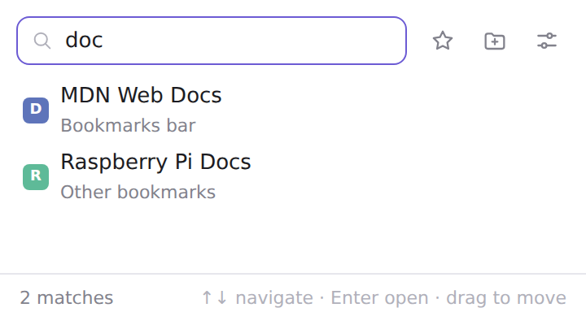

# BookmarkWizard 🪄

**Your bookmarks, without the bar.**

BookmarkWizard is a minimalist bookmark manager that lives in a toolbar popup. If you keep the
bookmarks bar hidden (as you should), everything is still one click — or one <kbd>Alt</kbd>+<kbd>B</kbd> — away.

| Light | Dark |
| --- | --- |
|  |  |

## Features

- **Instant search** — the search box is focused the moment the popup opens; just start typing.
  Results show their folder path so you always know where things live.
- **Full tree browsing** — Bookmarks bar, Other bookmarks, and every folder in between, with
  remembered expand/collapse state.
- **One-click save** — the star bookmarks the current page (into a folder you choose in settings)
  and opens an inline editor to rename or re-file it. The star fills in when the page is already
  bookmarked; clicking it again jumps to the existing bookmark.
- **Manage in place** — rename, edit URLs, move between folders, create folders, and delete
  (with a click-again confirm, no dialogs). Drag and drop to reorder or drop onto a folder to move.
- **Keyboard-first** — <kbd>↑</kbd>/<kbd>↓</kbd> to navigate, <kbd>→</kbd>/<kbd>←</kbd> to
  expand/collapse, <kbd>Enter</kbd> to open, <kbd>F2</kbd> to rename, <kbd>Delete</kbd> to delete,
  and typing anywhere returns you to search.
- **Light & dark** — follows your system theme, or pin either one in settings.
- **Private by design** — no background service worker, no analytics, zero network requests.
  Favicons come from Chrome's local favicon cache.



## Install

BookmarkWizard is a Manifest V3 extension for Chromium browsers (Chrome, Edge, Brave, Arc, …).

1. Download or clone this repository.
2. Open `chrome://extensions` and switch on **Developer mode** (top right).
3. Click **Load unpacked** and pick the `bookmarkwizard` folder.
4. Pin the wizard to your toolbar, then hide the bookmarks bar for good
   (<kbd>Ctrl</kbd>+<kbd>Shift</kbd>+<kbd>B</kbd> / <kbd>⌘</kbd>+<kbd>Shift</kbd>+<kbd>B</kbd>).

The popup opens with <kbd>Alt</kbd>+<kbd>B</kbd> (rebindable at `chrome://extensions/shortcuts`).

## Using it

| Action | How |
| --- | --- |
| Open a bookmark | Click, or <kbd>Enter</kbd> — current tab by default |
| Open in a background tab | <kbd>Ctrl</kbd>/<kbd>⌘</kbd>+click, or middle-click |
| Open in a new tab | <kbd>Shift</kbd>+click (or make it the default in settings) |
| Bookmark the current page | Click the star |
| Rename / edit / move | Hover a row → pencil, or press <kbd>F2</kbd> |
| Delete | Hover a row → trash, click twice to confirm (or <kbd>Delete</kbd> key) |
| Reorder / re-file | Drag rows; drop onto a folder to move into it |
| New folder | The folder-plus button in the header |

Settings (theme, default save folder, open-in-new-tab, favicons) live behind the sliders icon.

## Permissions

| Permission | Why |
| --- | --- |
| `bookmarks` | Read and manage your bookmarks — the whole point |
| `favicon` | Show site icons from Chrome's local favicon cache |
| `storage` | Remember your settings and which folders are open |
| `activeTab` | Read the current tab's title/URL when you hit the star |

No host permissions, no content scripts, no remote code.

## Development

Everything is vanilla HTML/CSS/JS — no build step. Edit, then hit reload on
`chrome://extensions`.

To regenerate the icons:

```sh
pip install pillow
python3 scripts/generate_icons.py
```

## License

MIT — see the [repository license](../LICENSE).
